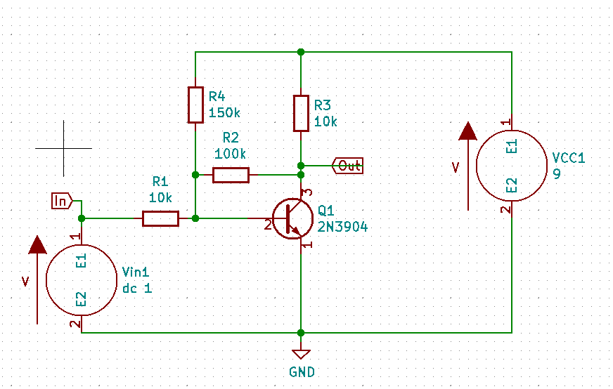
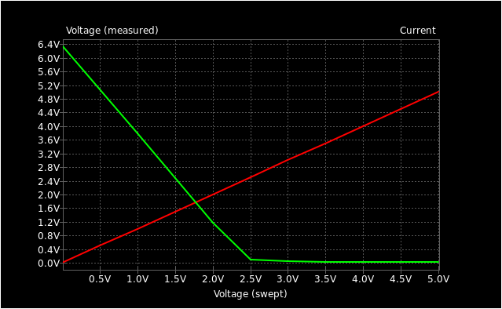

# Transistor Level Shifter

The aim was to make a minimal circuit with a linear response that will shift voltage levels from a sensor to make them more suitable for a microcontroller to read. This was prompted by w2aew's video : [#328: Circuit Fun: Op Amp Signal Conditioning - a Practical Example](https://www.youtube.com/watch?v=OlhN7ADpKds)

Specifically:

```
Input     Output
 2.5        0
 0.5        5
```




## KiCAD files

* level-shifter.sch
* level-shifter.cir

## Related

* [Designing (op amp) Gain and Offset in Thirty Seconds](https://www.ti.com/lit/an/sloa097/sloa097.pdf) (PDF)
* [Single Transistor Amplifier Stages] (https://wiki.analog.com/university/courses/electronics/text/chapter-9)
* [KiCAD](https://kicad.org/)
* [KiCAD libraries](https://kicad.github.io/)


